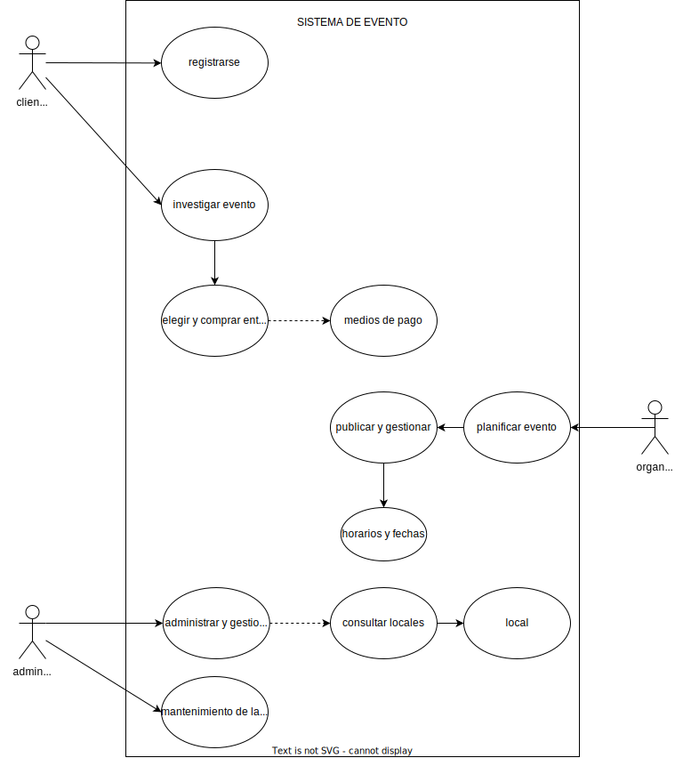

<h1 align="center"> E.T N°12 D.E 1° Libertador Gral. José de San Martín </h1>

  

# Plan de Aprendizaje : Sistema de Boleteria

# 👥 Integrantes del proyecto

* **Maycol Alconz**
* **Alina Martinez**
* **Rodolfo Paetz**

---

# Documentación del proyecto
  
## Diagrama de Entidad-Relación (DER)
- [Diagrama Entidad-Relación (DER)](docs/DER.md)
  
## Lenguaje Unificado de Modelado (UML)

## Casos de Uso 

---
# Arquitectura del proyecto

## Principios SOLID aplicados

- **Responsabilidad Única (SRP):** Cada clase tiene una única responsabilidad.  
- **Abierto/Cerrado (OCP):** Las clases están abiertas a extensión, pero cerradas a modificación.  
- **Sustitución de Liskov (LSP):** Las subclases pueden sustituir a sus clases base sin romper el funcionamiento del sistema. 
- **Segregación de Interfaces (ISP):** Se crean interfaces específicas para cada repositorio, evitando métodos innecesarios.  
- **Inversión de Dependencias (DIP):** La lógica de negocio depende de interfaces, no de implementaciones concretas (patrón repositorio).

---
# 📦 Paquetes Utilizados en el Proyecto

##🔐 Autenticación y Seguridad

* Microsoft.AspNetCore.Authentication.JwtBearer (8.0.21)
* Microsoft.IdentityModel.Tokens (8.14.0)
* System.IdentityModel.Tokens.Jwt (8.14.0)

##🗄️ Acceso a Datos

* MySqlConnector (2.4.0)
* Dapper (2.1.66)

##🧭 Mapeo y Transformación de Objetos

* Mapster (7.4.0)

##✔️ Validación

* FluentValidation (12.0.0)

##🧩 Configuración

* Microsoft.Extensions.Configuration (8.0.0)

##🧪 Testing

* Moq (4.20.72)
* xUnit (2.4.2)

##🪪 Generación de QR

* QRCoder (1.7.0)

--- 

